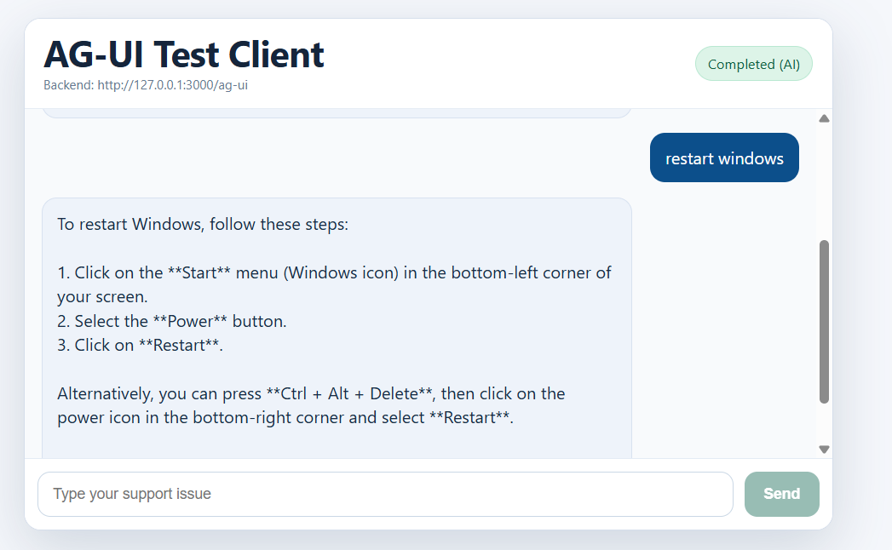
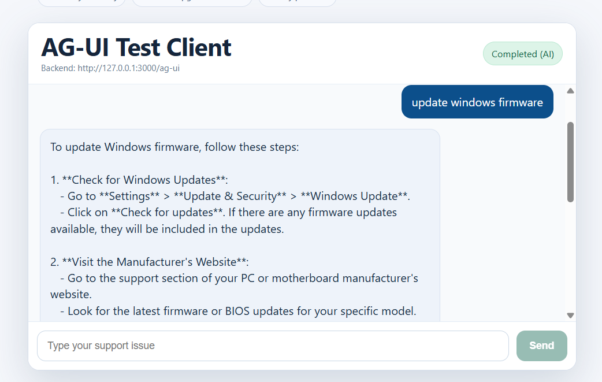
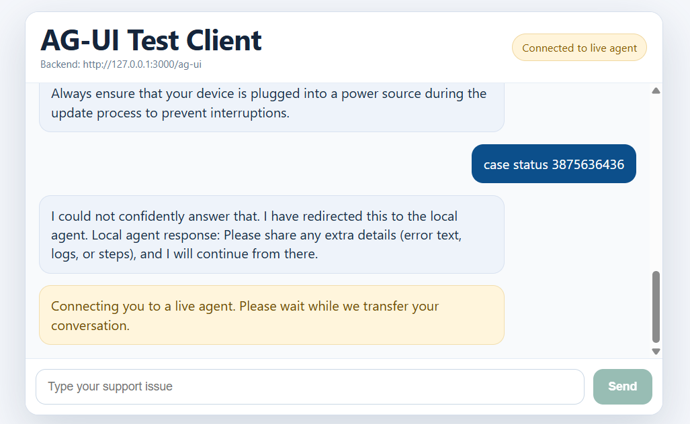

# POC AG-UI Demo (Frontend + Backend)

This repository contains:
- Backend: FastAPI AG-UI service
- Frontend: React test client integrated with AG-UI streaming

The app flow is simple:
1. User sends a query
2. AI answers first
3. If AI cannot answer, it auto-redirects to live agent flow

## Project Structure

- bff: Python FastAPI backend
- ag-ui-test: React frontend test app

## Prerequisites

- Python 3.11+
- Node.js 22.12+ and npm (required by the current Vite version)
- An OpenAI API key with access to the configured model for AI responses
- Git if cloning the repository, or download and extract the ZIP

## 1) Download and Open

1. Download/unzip or clone this project.
2. Open the repository root in VS Code: the folder containing `bff` and `ag-ui-test`.
3. Open two terminals at the repository root, one for each service.

The commands below are for local development. Keep both terminals running while
using the app. Do not include the `$` prompt when copying commands.

## 2) Backend Setup (bff)

### A. Create and activate a virtual environment (first time)

Create `.venv` locally before activating it. Reuse an existing environment only if
it was created at the current path; virtual environments are not portable.
If the project was moved or copied, deactivate the old environment and rename
`.venv` as a backup before creating a new one. Do not commit or distribute it.

Run one of these blocks in the backend terminal, starting at the repository root.

Windows Git Bash:

```bash
cd bff
py -m venv .venv
source .venv/Scripts/activate
```

Windows PowerShell:

```powershell
cd bff
py -m venv .venv
.\.venv\Scripts\Activate.ps1
```

Windows CMD:

```bat
cd bff
py -m venv .venv
.venv\Scripts\activate.bat
```

macOS / Linux:

```bash
cd bff
python3 -m venv .venv
source .venv/bin/activate
```

If `py` is unavailable on Windows, use `python` instead after verifying it is
Python 3.11+. Successful activation normally adds `(.venv)` to the prompt.

### B. Install dependencies

With the environment activated and the terminal inside `bff`:

```bash
python -m pip install -r requirements.txt python-dotenv
```

`python-dotenv` is needed to load `.env`; it is not currently listed in
[bff/requirements.txt](bff/requirements.txt).

### C. Configure environment

Copy [bff/.env.example](bff/.env.example) to a local `.env` file inside `bff`.
Do this only on first setup; do not overwrite an existing configuration.

Git Bash / macOS / Linux:

```bash
cp .env.example .env
```

PowerShell:

```powershell
Copy-Item .env.example .env
```

CMD:

```bat
copy .env.example .env
```

Edit the new `.env` file and set `OPENAI_API_KEY` to your own key. Never commit
this file or share the key. Without a valid key, AI responses will not work.

Optional settings in .env:
- OPENAI_MODEL=gpt-4o-mini
- OPENAI_BASE_URL=https://api.openai.com/v1
- OPENAI_TIMEOUT_SECONDS=20
- AGUI_STREAM_CHUNK_SIZE=24
- AGUI_STREAM_CHUNK_DELAY=0.02

### D. Run backend

Run from inside bff folder:

```bash
python -m uvicorn app.main:app --host 127.0.0.1 --port 3000 --reload
```

Health check:
- http://127.0.0.1:3000/health should return `{"status":"ok","service":"ag-ui-bff"}`.
- A healthy backend does not verify the OpenAI key; send a message in the frontend to test it.

## 3) Frontend Setup (ag-ui-test)

In the second terminal, starting at the repository root:

```bash
cd ag-ui-test
npm install
npm run dev -- --host 127.0.0.1 --port 5173
```

Open in browser:
- http://127.0.0.1:5173

The frontend connects directly to `http://127.0.0.1:3000/ag-ui` by default.

## 4) Stop and Restart Later

To stop the app, press **Ctrl+C** in both service terminals. You can then run
`deactivate` in the backend terminal to leave the Python environment.

After reopening VS Code or restarting your computer, open two terminals at the
repository root. You do not need to recreate `.venv`, copy the environment
template, or reinstall dependencies every time.

### Terminal 1: Backend (Windows Git Bash)

```bash
cd bff
source .venv/Scripts/activate
python -m uvicorn app.main:app --host 127.0.0.1 --port 3000 --reload
```

For PowerShell, use `.\.venv\Scripts\Activate.ps1` for activation; for CMD, use
`.venv\Scripts\activate.bat`; for macOS/Linux, use `source .venv/bin/activate`.
The backend start command stays the same.

### Terminal 2: Frontend (all platforms)

```bash
cd ag-ui-test
npm run dev -- --host 127.0.0.1 --port 5173
```

Open http://127.0.0.1:5173 again. If reusing terminals already inside `bff` or
`ag-ui-test`, skip the corresponding `cd` command. If the backend environment
is still activated, skip activation too.

After downloading dependency updates, rerun the backend installation command
from section 2B and `npm install` inside `ag-ui-test`, then restart both services.
Restart the backend after changing `.env`.

## 5) Troubleshooting

- **`.venv/bin/activate: No such file or directory` on Windows:** use
   `source .venv/Scripts/activate` in Git Bash. Windows uses `Scripts`, not `bin`.
- **`[200~source: command not found`:** press Ctrl+C and manually type
   `source .venv/Scripts/activate`, without `[200~`, trailing `~`, or `$`.
- **No `.venv` folder:** complete section 2A before trying to activate it.
- **PowerShell blocks activation scripts:** use Git Bash or CMD with the
   corresponding activation command above.
- **Missing Python modules:** activate the environment and rerun section 2B.
- **Vite reports an unsupported Node version:** install Node.js 22.12+ and reopen
   the terminal before running `npm install` again.
- **Port already in use:** stop the previous instance with Ctrl+C in its terminal.
   If Vite selects another port, open the URL it prints. If you change the backend
   port, set `VITE_AGUI_URL` in the frontend environment to the matching `/ag-ui`
   URL before starting Vite.
- **Backend is healthy but AI responses fail:** check the API key, model access,
   network connection, and backend logs. Confirm `python-dotenv` is installed and
   restart the backend after updating configuration. Do not share logs containing secrets.

## 6) Verification Checklist

- Backend status is running with no import errors
- Frontend opens at port 5173
- Sending a normal query returns AI response
- If AI cannot answer or user asks for live agent, status changes to live-agent handoff flow

## API Used by Frontend

- POST /ag-ui (SSE stream)
- GET /health

## Tested




